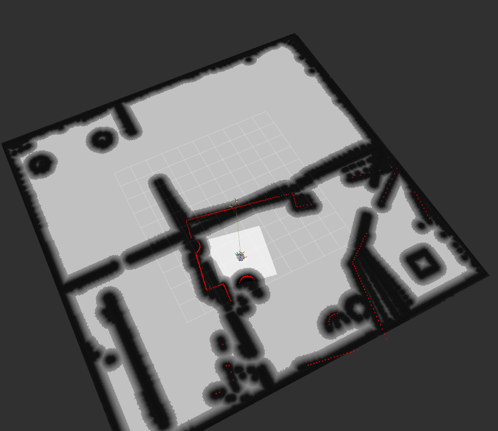
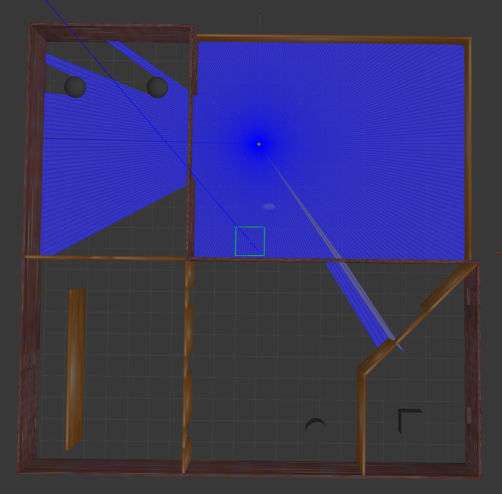
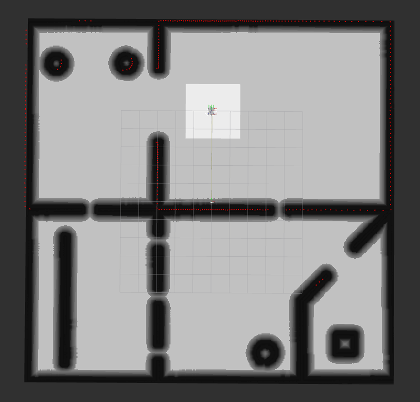
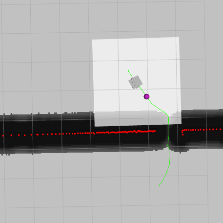

# testbed_navigation: 

## Aim

This package implements localisation and autonomous navigation of the bot on the map after loading it. In this implementation, each Nav2 component is launched using 3 launch files (as shown in package structure) and has configuration files for parameter storing and easier tuning instead of using nav2_bringup (ready made package which starts navigation on running a single command).

## Package structure
testbed_navigation/
├── launch/
│   ├── map_loader.launch.py  # map_server and lifecycle manager: loads the map and publishes /map
│   ├── localization.launch.py  # AMCL and lifecycle manager: localises bot and publishes the map to odom TF
│   └── navigation.launch.py  # planner, controller, BT navigator, behavior server and lifecycle manager
└── config/
    ├── amcl_params.yaml  # AMCL parameters - frames, laser/motion model, particle filter, initial pose
    └── nav2_params.yaml # local and global costmaps, NavFn planner, RPP controller, BT navigator, recoveries

## How to run
cd ~/assignment_ws && colcon build --symlink-install && source install/setup.bash
 each in individual terminal, in this order:
ros2 launch testbed_bringup testbed_full_bringup.launch.py
ros2 launch testbed_navigation map_loader.launch.py
ros2 launch testbed_navigation localization.launch.py
ros2 launch testbed_navigation navigation.launch.py
Then in RViz: "2D Goal Pose" is used to set a goal which the bot will plan the path to and follow using pure pursuit

## Approach

I went with 3 separate launch files with each of them having a lifecycle manager (for all the nodes launched by the particular launch file - to congfigure and activate them) because I wanted to separate the 3 layers with different functionalities. Each layer depends on the one before it. 

### 1. Map loading layer: map_loader.launch.py
The map_loader launch file will load the map first using `testbed_world.yaml` + `.pgm` and publishes it on `/map`. The global costmap later uses this map for planning.

**Test:** Displayed the map on RViz (Fixed Frame `map`, Durability set as *Transient Local*), with white (free), black (walls) and grey (unknown) areas.

### 2. Localization layer: `localization.launch.py`
Then the localization layer is started. Using the map (surroundings around the bot), the bot uses AMCL (comparing LiDAR point cloud with the map to estimate the bot position) to localise itself in the surroundings. It also publishes the `map → odom` transform.
**Test:** The scan lined up with map walls and the particle cloud shrunk while the bot was driving, which showed successful localisation

### 3. Navigation layer: `navigation.launch.py`
Finally the navigation part is launched which takes up map (global costmap), live scan (local costmap) and bot position
from AMCL and performs path planning and control to reach the goal point. 

**Test:** A goal set with 2D Goal Pose and the robot follows and reaches it, with visualised lookahead point and planned trajectory (NavFn, A\*)

## Plugin choices

### Planner: NavFn (A*)
NavFn finds the least cost path on the global costmap. The cost includes inflation around walls and so the path just naturally stays reasonably away from obstacles. I enabled A* (`use_astar: true`) so the search expands towards the goal instead of in all directions like in case of Dijkstra.

In the given problem statement, testbed is a differential drive robot and can turn in place, so any path on the grid is drivable. I didn't use Smac Hybrid-A* because it is usually used for for robots which have a car model that is, they can't turn in their place and would add unnecessary tuning without any benefits

### Controller: Regulated Pure Pursuit (RPP)
RPP follows the path by steering towards a lookahead point (0.6 m ahead, but it is a tunable parameter) on it. The regulated part slows the robot down on tight curves and when the bot is near to approaching the goal. Taking use of differential drive, I added `use_rotate_to_heading` that is, if the path's direction is more than 45° away from the robot's heading, it first rotates in place and then drives.

I chose it over DWB because it has much lesser parameters in it and is also easier to tune. DWB on the other hand, samples a lot of velocity commands and scores them with a large set of critics which are definitely more than those needed for simple navigation. I was also familiar with the functioning of Pure Pursuit and so in a time crunch, I prefered using that.

Disadvantage of RPP: RPP stops when any obstacle blocks the path instead of swerving around it. But the behavior tree replans every second, so a new path around the obstacle is found and then RPP resumes.

### Costmaps
- **Global costmap:** It has static + inflation layers only. The map already contains all the walls; with a live obstacle layer. While testing small heading errors at long range kept drawing tilted walls, showing signs of drift, that hindered planning efficiency (discussed in Challenges).
- **Local costmap:** It has obstacle + inflation layers. It is basically a 3x3 m window around the bot which is built from the live LiDAR scan so new obstacles near the robot are still detected.

## Challenges

## Minor Road blocks

### 1. Bugs in the starter code
The provided packages had five bugs that stopped the build, the map from
loading, or localization from working properly (missing `()` on
`ament_package`, `use_sim_time` not set on `robot_state_publisher`, 1.5 m lidar
range, `maps/` folder not installed, wrong image path in the map YAML).
Details of each bug and fix are in [`BUGS.txt`](../BUGS.txt).

### 2. Map not showing in RViz
`map_server` was running and `ros2 topic info /map` showed a publisher also, but RViz was showing *"No map received"*. This happened because `map_server` publishes the map only once (that is when it activates). But RViz was subscribing after that and missed it because the Map display's default durability is *Volatile*.
**Fix:** I set the Map display's Durability Policy to *Transient Local*, so RViz receives the last published message. The same setting (`map_subscribe_transient_local: true`) is used by the global costmap's static layer for the same reason. 

### 3. Package created outside the repository
I first created `testbed_navigation` in the workspace root instead of inside the cloned repo. `colcon` still found and built it, so everything worked, but git couldn't see it and it would not have been part of the submission.
**Fix:** I moved the package into the repo and deleted its old `build/` and `install/` folders — with `--symlink-install`, the installed files were links to the old location and would have been broken after the move.

## Major Challenges

### 1. Incorrect walls drawn in the global costmap due to drift
After driving for a while, walls in the global costmap got redrawn over and over, each time slightly more rotated, forming fan-shaped streaks — especially in the bottom-right room(as can be seen in the image). The planner treats these as real obstacles.

I checked the map image (`.pgm`) and it was clean. So the streaks were being added at the runtime by the costmap's obstacle layer. The fan shape pointed to a **heading (yaw) error** more than a position error, because the walls weren't offsetting in position. A wrong heading
rotates everything around the robot, so nearby walls barely move but walls that are far away will swing a lot (0.01 rad of error = 10 cm at 10 m). As the global costmap's obstacle layer was marking obstacles up to 11.5 m away, each of the small heading error drew the far walls at a new angle, and they were never cleared.

**Fixes:**
- Tried to remove the obstacle layer from the global costmap (static + inflation only). I thought that the map already has all the walls and so the planner doesn't really need live marking. The new obstacles near robot are handled by the local costmap. But this created a new problem (Problem 3)
- Lowered AMCL odometry noise parameters (`alpha 1–4`: 0.2 → 0.05), as Gazebo's odometry is nearly perfect and high values made the particles spread in heading every time the robot turned

### 2. Tuning Lookahead Distance
Initially, lookahead distance was set as 0.1m by me. In this case, right after a turn if the bot found a straight path, it oscillated and overshot. This led to me setting lookahead distance of 2m, which now caused the bot to cut through turns. This was a nightmare on turns near the doors as the bot led straight onto the walls. 

**Fix:** Through trial and error, I finally settled to a lookahead distance of 0.6m which didn't show oscillations or unnecessary cutting through corners of the path.

### 3. Planner routing through gaps narrower than the robot
While testing if the bot is able to reach the goal pose, I added obstacles on doorways of the map to see how the planner would react. In some case, very narrow gaps and crevices would be left and the planner would plan a path through it. The bot only realised this when it got close to obstacle(when the local costmap saw the obstacle) and then it replanned. As soon as it moved away, it planned through the gap again.

**Causes:**
- **No obstacle layer in the global costmap.** I had removed it to fix the fanning walls. So the planner only knew about the walls in the map and not about the new obstacles. It saw them only when they were inside the local costmap and then forgot them once the bot moved away.
- **Footprint was small for planning.** I was using a polygon footprint measured from the bot's meshes. Because `base_footprint` (= `base_link`) is near the front of the robot and not its centre, this polygon was lopsided (x: −0.23 to +0.13 m, y: −0.245 to +0.17 m) and the inscribed radius(distance from the centre to the nearest edge) became only as 0.13 m. Now, NavFn plans for a single point and uses this radius to keep away from obstacles. So gaps wider than 0.26m are treated as passable, while the bot is actually around 0.42 m wide.

**Fixes:**
- Re-added the obstacle layer back to the global costmap, with short and equal marking/clearing ranges:
  `obstacle_max_range: 4.0`, `https://drive.google.com/file/d/1uR2-_aUrGKHvU6WptfLLC5KXccMwTNkP/view?usp=drive_linkraytrace_max_range: 4.0`.
  At 4 m, a small heading error is considerably less than 1 cell, so the fanned walls don't come back. By keeping both the ranges equal, it ensured that an obstacle seen once stays marked. If I set clearing longer than marking, then the farther away laser hits could erase it without marking it again.
- Removed the polygon `footprint` from both of the costmaps and used
  `robot_radius: 0.34` instead. This is basically a circle coverng the whole body. This blocks the gaps that are narrower than 0.68m, while the map's doorways (~0.9–1.0 m) stay
  passable.
- Tuned the inflation layer parameters: `inflation_radius: 0.6`, `cost_scaling_factor: 2.0`. Cost now stays higher further from obstacles, so the planner prefers wide doorways over tight gaps. If I increases inflation radius, the bot struggled to even pass through doorways. But when I increased the cost_scaling_factor, the gaps in middle of doorways got cheaper and became more favourable to pass through. 

## Results
<!-- Screenshots (media/*.png) + link to video.
     What works, and what you'd improve with more time
     (e.g. velocity_smoother, fixing base_link offset, tuning inflation). -->
1) LiDAR range increased

2) Image showing global costmap(white, gray, black areas), local costmap (square around the bot), LiDAR point cloud  (red dots)

3) Image showing planned path, lookahead pure pursuit waypoint in RViz

Demo videos: 
- [Fully Functioning Navigation Pipeline](https://drive.google.com/file/d/16JM8kUl2kOCCqEW51BvcFyhWZBayCMCy/view?usp=drive_link)
- [Narrow Crevice bug in simulation](https://drive.google.com/file/d/1Lz2YHUYpgpAQG9Pav9BJJmBwIA5bdWlR/view?usp=drive_link)
- [Narrow Crevice bug fixed](https://drive.google.com/file/d/1uR2-_aUrGKHvU6WptfLLC5KXccMwTNkP/view?usp=drive_link)
- [Drive folder for all video links](https://drive.google.com/file/d/16JM8kUl2kOCCqEW51BvcFyhWZBayCMCy/view?usp=sharing)

## Possible future improvements

- **Obstacle avoidance that swerves:** I could try an MPC based controller like MPPI or maybe DWB instead of RPP. These controllers are not reactive, they are predictive and so the robot can steer around obstacles instead of stopping and waiting for a replan.

- **Acceleration limits by using `velocity_smoother`:** RPP doesn't limit linear acceleration and so velocity commands can jump. Adding Nav2 `velocity_smoother` between the controller and the base would limit acceleration and jerk. This would create a huge difference on a real robot which will have wheel slip and tipping.

- **Fix the robot's reference frame:** I could move `base_footprint` to wheel axle midpoint in the URDF. Now the tighter polygon footprint can replace the very conservative circular `robot_radius`.
